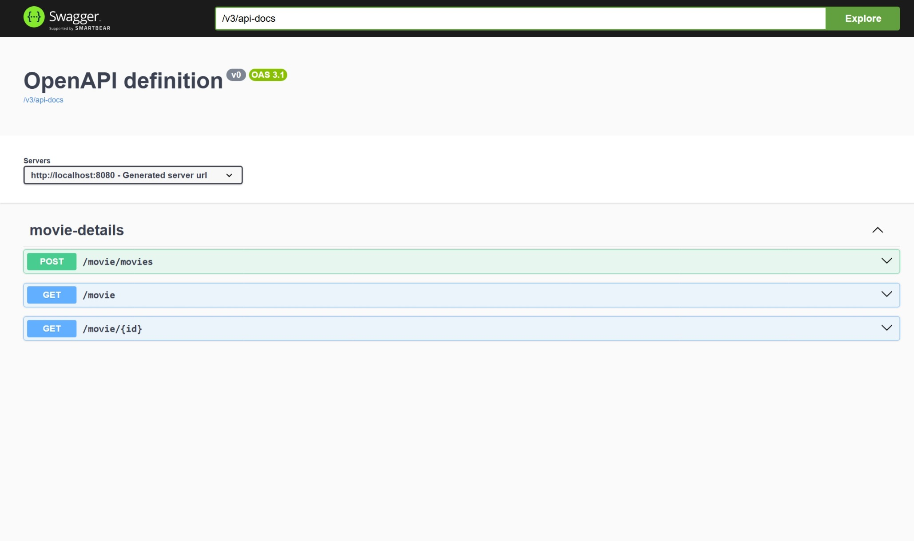

#  My Website - Cineworld Ticket Booking System

Welcome to the **Cineworld Ticket Booking System** project! This web application allows users to browse, select, and book movie tickets at Cineworld cinemas. It offers a user-friendly interface, real-time seat availability, and a secure booking system.

---

<<<<<<< HEAD
##  Project Description
=======
## Project Description
>>>>>>> 2e0d4746e606c57b077f4a788ec6f9f07fa407ca

This is a full-stack web application built for managing movie ticket bookings at Cineworld. Users can:
- View movie listings and showtimes
- Book tickets for available shows
- View booking history
- Manage profiles

Admins can:
- Add or manage movies, shows, and cinemas
- View booking statistics
- Manage users

---

<<<<<<< HEAD
##  API Design Document

You can view the full API design document here:  
 [API Design](https://example.com/api-design)

---

=======
>>>>>>> 2e0d4746e606c57b077f4a788ec6f9f07fa407ca
##  Architecture Diagram

The architecture diagram for the project is available here:  
 [Architecture Diagram](https://docs.google.com/document/d/1yl6xmWp0OoZCzIsZ5fOLyxQkj5XqJI62LwRWQJNVDYQ/edit?tab=t.0)

---

##  ER Diagram

You can find the Entity Relationship (ER) diagram here:  
 [ER Diagram](https://docs.google.com/document/d/1yl6xmWp0OoZCzIsZ5fOLyxQkj5XqJI62LwRWQJNVDYQ/edit?tab=t.v1364nt7irmm)
<<<<<<< HEAD

---

##  UI Screenshot


---

##  Swagger UI Screenshot

The project includes a Swagger-based API documentation for testing and exploring API endpoints:



---

## Tech Stack

- **Frontend**: HTML, CSS, JavaScript (or your stack, e.g., React)
=======


---

## Tech Stack

- **Frontend**: HTML, CSS, JavaScript
>>>>>>> 2e0d4746e606c57b077f4a788ec6f9f07fa407ca
- **Backend**: Java with Spring Boot
- **Database**: MySQL
- **API Documentation**: Swagger


<<<<<<< HEAD
##  Getting Started

To run the project locally:

1. Clone the repo  
   ```bash
   git clone https://github.com/your-username/your-repo.git
=======
>>>>>>> 2e0d4746e606c57b077f4a788ec6f9f07fa407ca
